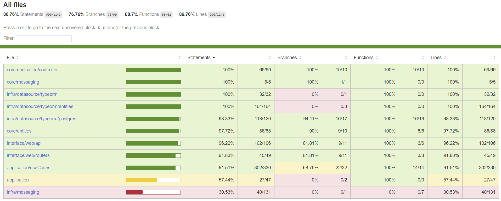

# Appointments Service - Microservice

Projeto exemplo para Hackaton com objetivo de propor uma solução para gestão de cadastro e agendamento de consultas entre médicos e pacientes.

## Contexto

Este microserviço é parte da aplicação e abrange apenas as funcionalidades de cadastro de agenda médica, listagem de médicos e suas agendas disponíveis e reserva de horário.

Foi desenvolvido em Node.js utilizando TypeScript, PostgreSQL, TypeORM, RabbitMQ, e segue o padrão de arquitetura em camadas com princípios SOLID. O serviço se comunica com o microsserviço [notifications-service](https://github.com/devair/notifications-service) via RabbitMQ.


## Pré-requisitos

Antes de começar, certifique-se de ter os seguintes itens instalados em sua máquina:

- [Docker](https://www.docker.com/get-started)
- [Docker Compose](https://docs.docker.com/compose/install/)

## Execução com demais microsserviços

Este microsserviço deve ser executado via docker compose utilizando o projeto contido no repositorio [Hackaton](https://github.com/devair/hackaton-2024), pois existe a dependência de um container com o RabbitMQ e uma instância do Postgres.


## Variáveis de ambiente
Abaixo segue um exemplo das variáveis de ambientes utilizadas nesta aplicação:

```bash
DB_HOST=localhost                 
DB_PORT=5433
DB_DATABASE=appointments_db
DB_USER=docker
DB_PASS=docker

# Configurações do RabbitMQ
RABBITMQ_URL=amqp://localhost

# Configuraçao para geraçao do token JWT
JWT_SECRET=MySeCrEt
```


## Documentos

Relatório de testes unitários está contigo do diretório deste projeto [./static/coverage/lcov-report/index.html](./static/coverage/lcov-report/index.html)

Imagem do relatorio
